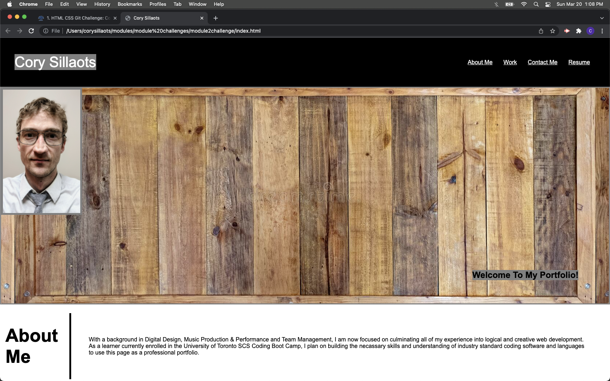

## Personal Biography Challenge (Module 2)
The purpose of this challenge was to start creating an online portfolio for potential employers to view.

Active URL: [CorySillaotsBioPage](https://corysillaots.github.io/Student-Bio-Page/)

## Installation:
In order to access the files needed to complete the challenge see: https://github.com/CorySillaots/module-2-challenge and clone either the following HTTPS link or SSH key:
HTTPS Link: https://github.com/CorySillaots/module-2-challenge.git
SSH Key: git@github.com:CorySillaots/module-2-challenge.git
In order to clone the project to a "projects" directory, open your terminal (mac) or gitbash (windows) window and type the following commands into your terminal/gitbash command line:
1 - mkdir projects
2 - cd ./projects (You can use the command "pwd" to ensure you are in the correct directory)
3 - git clone <HTTPS link> OR git clone <SSH Key>
4 - ls (this will list all of the files now inside of the current directory)

Open your coding software, select "open file" and locate the module-1-challenge file in your projects directory OR find the correct file in your directory and "Open With" your coding software.

## Usage
- This website's main purpose is to serve as an online portfolio and needs to meet the following criteria:
- Developers name and a recent photo or avatar.
- Links to information about them, their work and how to contact them.
- Links must scroll to corresponding sections. 
- Application should get larger when mouse icon hovers over them.
- Applications that are available should bring user to appropriate live URL of the application.
- The website must be responsize and adaptable for different screen sizes.

## Collaborators and References
- Brennen Merrett
    https://github.com/BrennanJLM

- Run Buddy Project Code
    University Of Toronto SCS Coding Boot Camp

- W3 Schools
    www.w3schools.com
## License
Copyright 2022, Cory Sillaots

Permission is hereby granted, free of charge, to any person obtaining a copy of this software and associated documentation files (the "Software"), to deal in the Software without restriction, including without limitation the rights to use, copy, modify, merge, publish, distribute, sublicense, and/or sell copies of the Software, and to permit persons to whom the Software is furnished to do so, subject to the following conditions:

The above copyright notice and this permission notice shall be included in all copies or substantial portions of the Software.

THE SOFTWARE IS PROVIDED "AS IS", WITHOUT WARRANTY OF ANY KIND, EXPRESS OR IMPLIED, INCLUDING BUT NOT LIMITED TO THE WARRANTIES OF MERCHANTABILITY, FITNESS FOR A PARTICULAR PURPOSE AND NONINFRINGEMENT. IN NO EVENT SHALL THE AUTHORS OR COPYRIGHT HOLDERS BE LIABLE FOR ANY CLAIM, DAMAGES OR OTHER LIABILITY, WHETHER IN AN ACTION OF CONTRACT, TORT OR OTHERWISE, ARISING FROM, OUT OF OR IN CONNECTION WITH THE SOFTWARE OR THE USE OR OTHER DEALINGS IN THE SOFTWARE.

